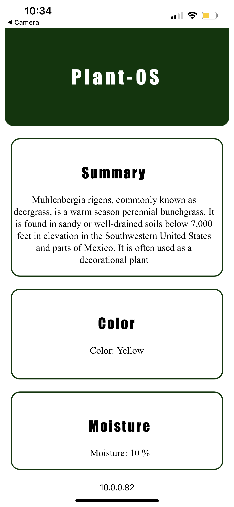

# LED-indicating-Moisture

#### Materials
This simple project gives you opportunity to do that with two main components 
  1. ESP-32
  2. WS2812B LED strips
  3. Soil Moisture Sensor
  4. Plant
 

#### About
Have you ever wanted to take extra care fo your plants in a easy manner? This is a little project I've been working on. Its purpose is to indicate the moiusture level of plant soil and display that through a website and LEDs. This project uses a ESP-32 to host a HTML page and uses WS2812B LED strips to indicate the moisture level through an LED. 

#### project

#### HTML page

#### View a demonstration here...
https://youtu.be/pCjIZ8a8sCA
